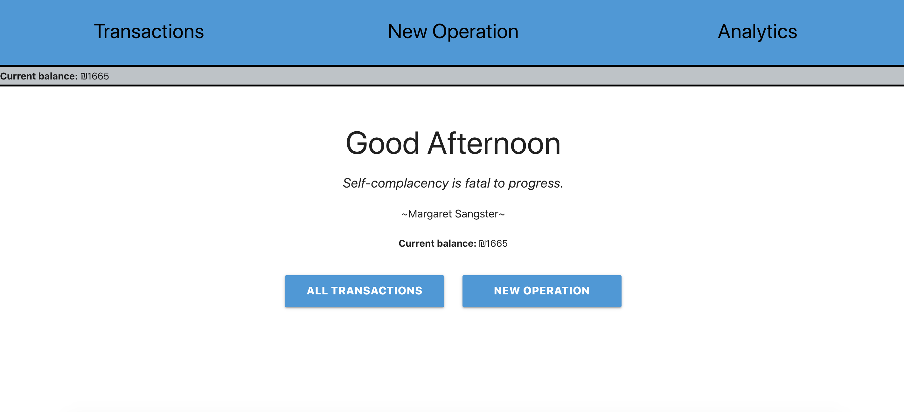
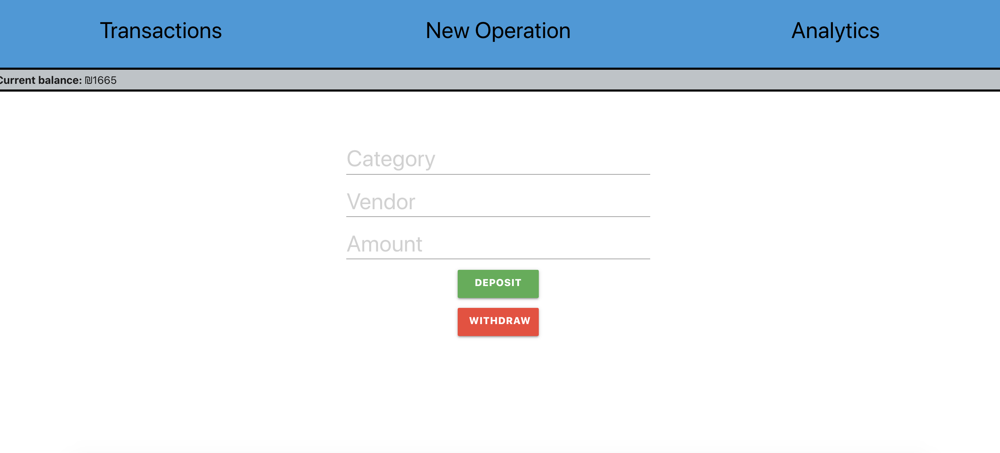
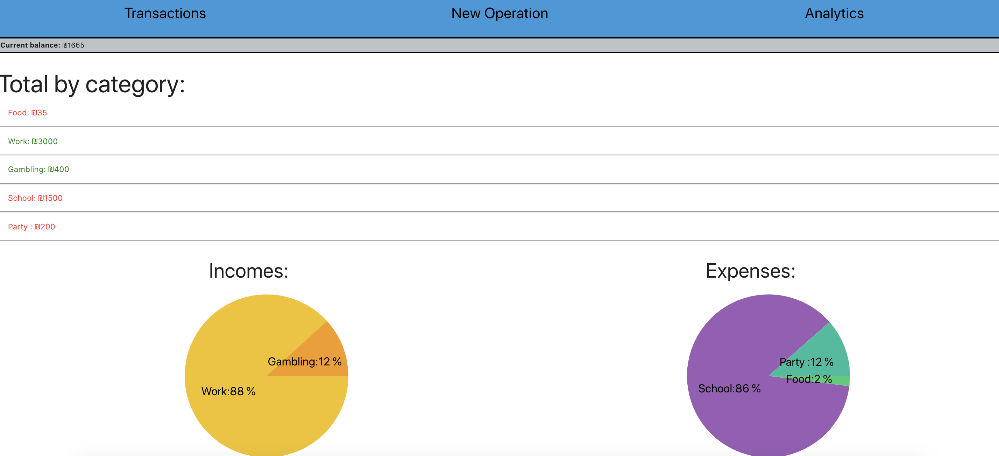

# React Bank

React Bank is my first project using react. The app allows users to track their expenses and view all their expenses by category. Although the design wasn't the core goal of this project, i added some basic pie charts, and made it fit for mobile view as well as web.

Demo: [https://react-bank-eitang.herokuapp.com/](https://react-bank-eitang.herokuapp.com/)

## Table Of Contents
- [React Bank](#ReactBank)
  * [Running the project](#running-the-project)
  * [Screenshots](#screenshots)
    + [Expense-List](#expense-list)
    + [Add Expense](#add-expense)
    + [Reports](#reports)
    + [Menu](#menu)
  * [Tech Stack](#tech-stack)

## Running the project

Preferably check the online demo, 

Otherwise:

1. Clone the repo.
2. Run `npm install`.
3. Run `npm run build`
4. Run `mongod`
5. Run `npm start`.
6. Navigate to `http://localhost:4000`.

## Screenshots

### Landing Page
A landing page greeting the users, includs a random quote (From Random quotes API).

### Transactions
An overview of all your expenses.

### Add Expense
Fill out the inputs and then either add a new *Deposit* or a new *Withdraw*.

### Analytics
A basic overview of your expenses by category, and some simple piecharts as visual aids.

## Techstack
1. React, Material-UI and Axios. 
2. Express (Node.js), Mongoose (MongoDB).
3. A cute simple random quotes API